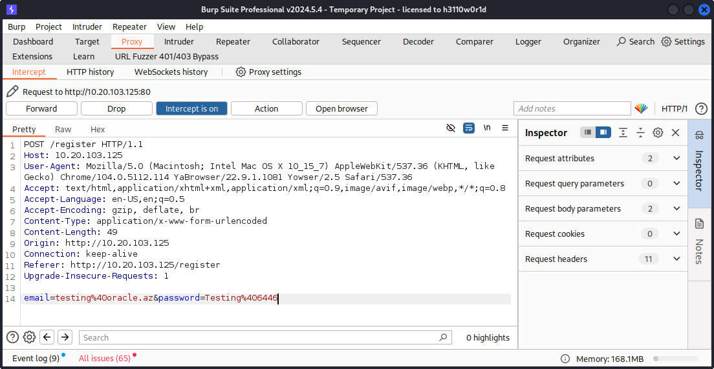
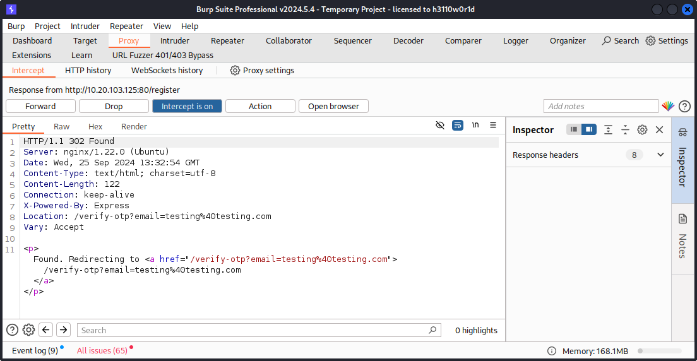
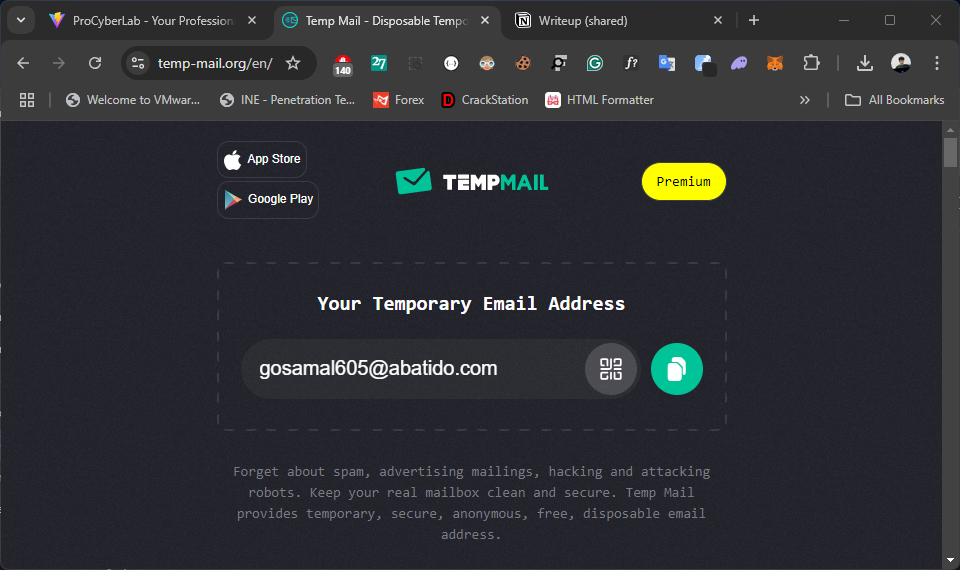
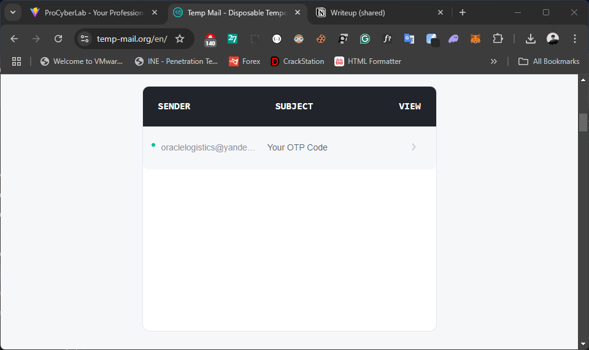
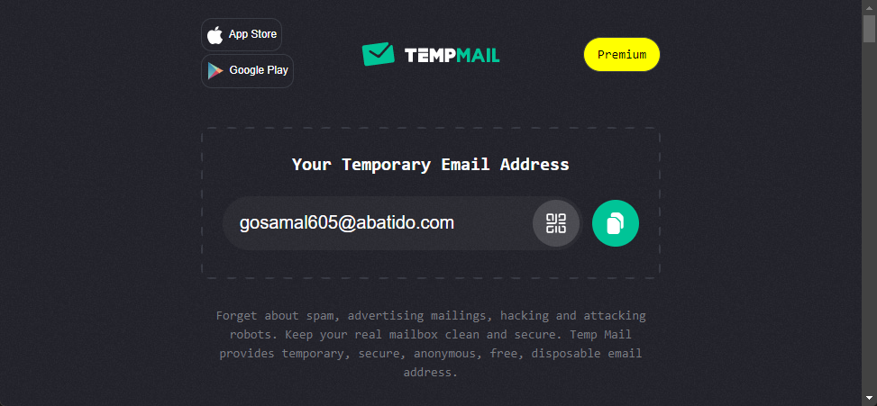
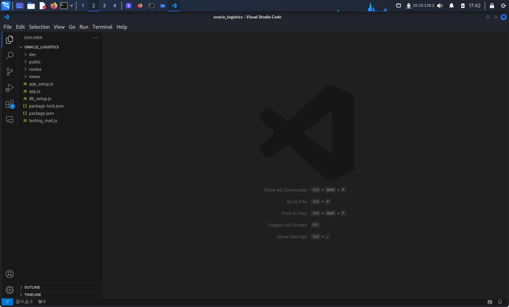
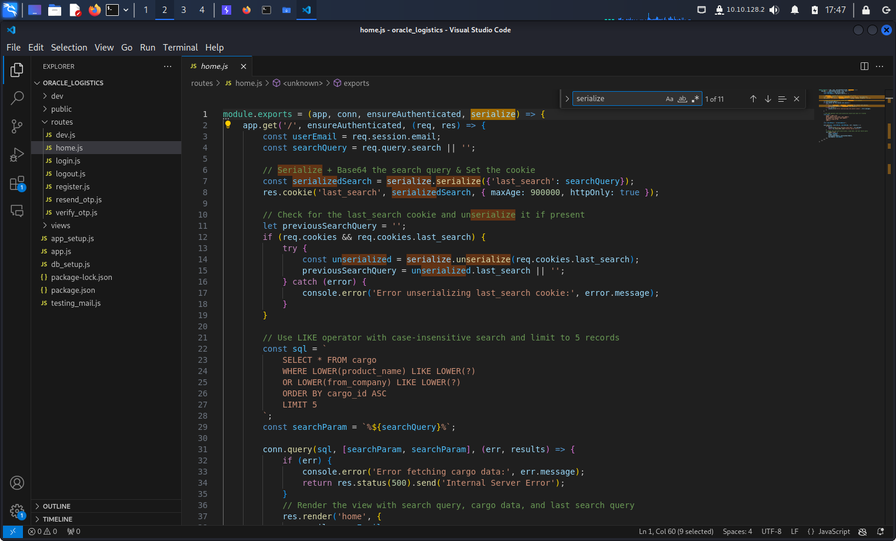
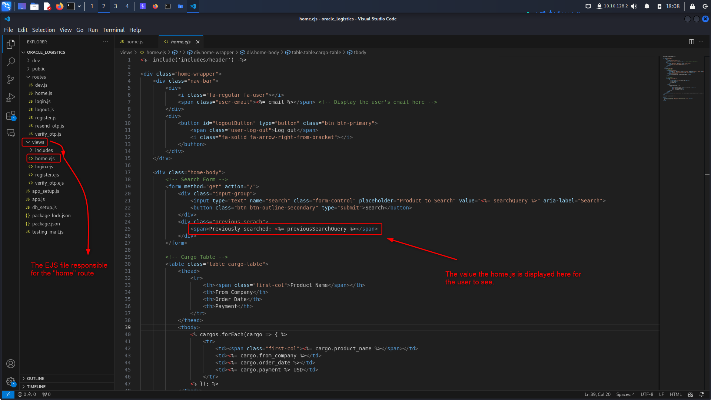

# Serial Escape

To start with you can run a simple NMAP scan against the target.
```
nmap -sV -v <target IP>
```


Based on the NMAP results, there are two ports open: SSH (22) and HTTP (80).
If you navigate to the target IP address on a browser you will see a page as follows.


Based on the error message, you can understand that the base URL "/" requires authentication to visit.

To discover directories on the web application, you can use a directory brute-forcing tool like FFUF. This revealed an additional directory named 'dev', which also requires authentication.


When you navigate to the registration page, you will see that the form requires you to enter an email address ending with "@oracle.az" only.


Upon registering, the application sends an OTP code to the provided email for verification, ensuring that users cannot create accounts with fake email addresses. However, after further inspection, you can notice that the email validation (checking if it ends with '@oracle.az') is only performed on the client side.


Som, you can fill out the registration form with dummy inputs, capture the network traffic with Burp Suite, and replace the email address with one of your choice (either an email you own or a temporary/disposable email) to receive the OTP code and pass verification.

For demonstration purposes, a temporary email was used.
https://temp-mail.org/




















